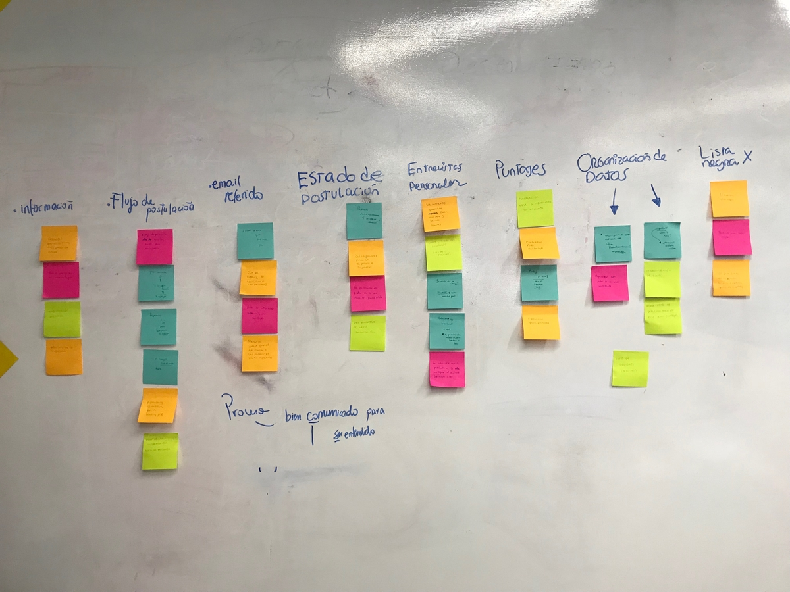
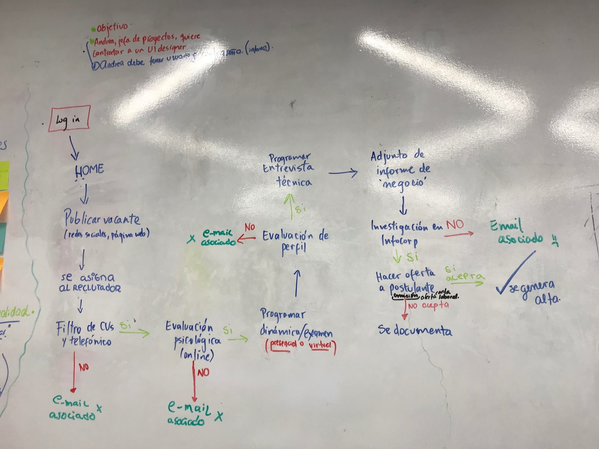
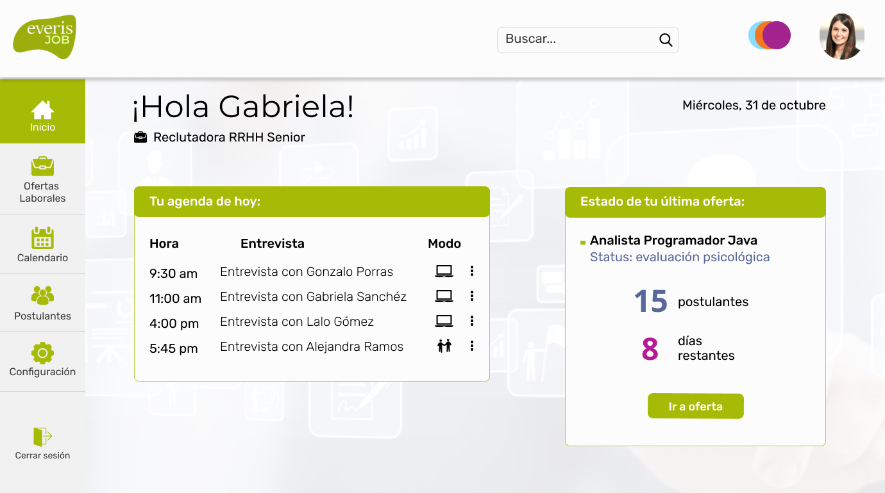

# Reto Everis Hackaton

## Introducción

Para esta hackaton interna de 36 horas de Laboratoria me dieron junto a mi equipo de UX Designers el reto [Everis](https://www.everis.com/global/es), una consultora multinacional de tecnología. 

## Detalles del reto

Everis nos entregó un documento donde detalló lo siguiente:

1. Introducción de su unidad de negocio T&AS (Technology and Advanced Solutions) y cómo está conformada.
2. Características de las carreras profesionales en Consultoría IT en el T&AS.
3. Cuadro del proceso de reclutamiento de Everis.
4. Modelo de informe de entrevista.

### **Reto**

Everis necesita gestionar, de forma adecuada, la incorporación de consultores a sus distintos proyectos. Los Gerentes no cuentan con mucho tiempo disponible y, al ser un tema en el que demostrar experiencia técnica y conocimientos específicos tiene un peso importante, hacer eficiente ese seguimiento ayudaría a ahorrar tiempo y no atrasar proyectos o mover a personas clave. Tener esta visibilidad ayudaría a maniobrar, priorizar y gestionar las peticiones, así como conocer de primera mano al candidato, inclusive llegando al CV.

A. Actualmente el proceso de búsqueda se basa en tres grandes modelos:
1) Búsqueda proactiva en redes de empleo (LinkedIn).
2) Candidatos inscritos para una necesidad.
3) Referidos.

B. Clasificación y rankeo:
1) Lectura del CV.
2) Primer contacto con el candidato.
- Proceso de entrevistas.
- Optimizar el proceso de resultados.

### **Objetivo**

Diseñar una aplicación y su experiencia usuario, que permita mejorar los procesos de reclutamiento de nuevos colaboradores. Asimismo, deberá permitir a los Gerentes de T&AS, equipo de reclutamiento y entrevistadores, hacer el seguimiento en línea de estos procesos de reclutamiento.

## Proceso

Analicé la información dada por Everis junto con mi equipo para comprender el problema y lo que necesitaba la empresa.

#### **Benchmark**

Se realizó benchmark de algunos websites como Hire by Google, Navent, Workbeat, etc. para entender a otras empresas del mercado que tengan la misma o similar enfoque. ([Acceder al Benchmark realizado](documentos/Benchmark.pptx))

#### **Affinity Map**

Entrevisté con mi equipo a algunas personas que trabajan en procesos de selección para diversos fines. Con las conclusiones de esas entrevistas, se pudo realizar un affinity map que permita obtener qué temas y detalles son más importantes y necesarios.

#### **Mapa del proceso de reclutamiento**

Con el mapa del proceso se puede visualizar el flujo que siguen durante un reclutamiento, y ayudó a establecer los datos que se requieren para la solución.

#### **Prototipado**

Luego de analizar el proceso de reclutamiento de Everis y tener más claras las necesidades, se realizó algunos sketches para visualizar la solución. Luego se diseñó el prototipo de alta fidelidad.

[Ingresa al prototipo interactivo](https://www.figma.com/proto/Iw25o0iUyViMmFoeMAVKp9/Hackaton-Laboratoria-Everis?node-id=0%3A1&scaling=contain)

#### **Testings**

Se realizaron testings de la primera versión del prototipo a personas encargadas de procesos de selección. Como conclusión se obtuvo que para publicar una oferta de trabajo se debe automatizar la mayor parte posible. Tener plantillas de la descripción y otra información, especialmente si son ofertas que se han hecho antes, en ese caso incluso las pruebas tendrían que estar preseleccionadas, ya que el sistema debe guardar esos datos. 

También se obtuvo que al final de publicar una oferta, las personas testeadas preferían un mensaje confirmando la publicación y también un resumen de ella. 

De la misma manera, hubo una preferencia por ver primero en qué etapa se encontraban los postulantes, y en segunda instancia ver un resumen general. Además, resultó importante saber si los postulantes eran referidos por trabajadores o contactos, no era primordial que se muestre de dónde habían postulado, solamente saber si los referían, ya que al ser recomendados daba más seguridad.

Para los usuarios testeados, no les parecía muy importante medir la experiencia por años, sino que preferían verla por proyectos, por eso el CV les resultó una buena herramienta. También querían ver detalles como quién los había entrevistado o evaluado. Les pareció muy bien implementar los comentarios que puedan hacer los reclutadores sobre el postulante, para saber cómo va.

